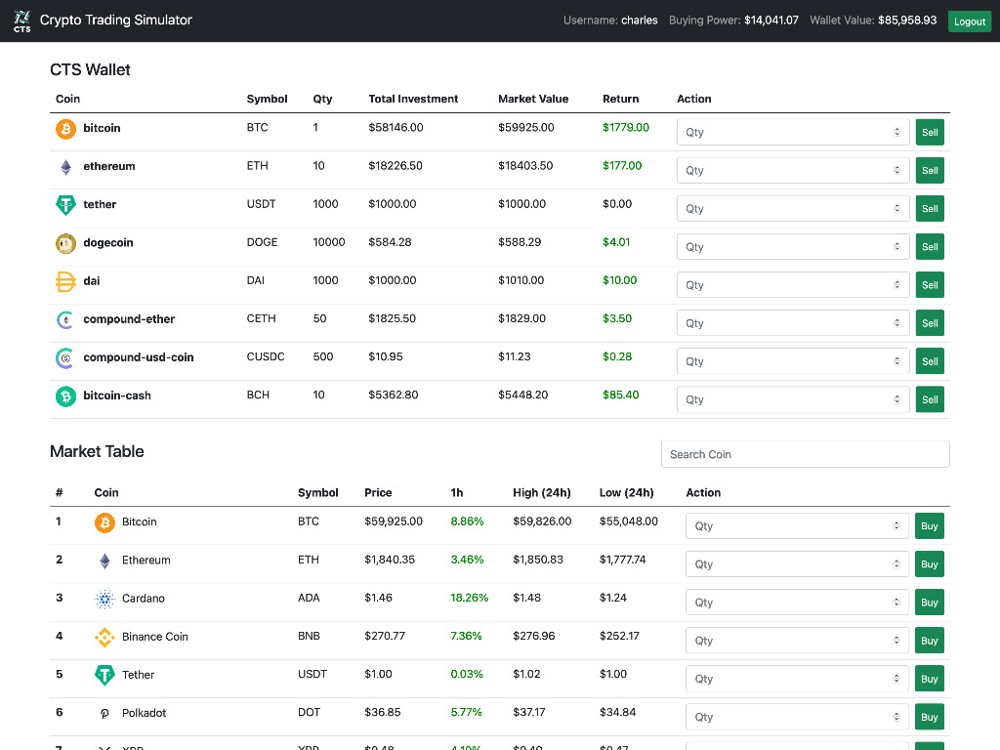

# Crypto Trading Simulator

Crypto Trading Simulator (CTS) is a JavaScript web app that simulates a cryptocurrency trading platform. This web app uses the CoinGecko API to fetch up-to date market data of the top 100 cryptocurrencies on their market. The market data is then rendered into the web apps market table which updates the data at an interval. A user is given a $100,000.00 (Fake Currency) as their starting buying power which they can use to buy and sell cryptocurrencies at their current price. Each coin that is bought is then stored into the Rails backend API and rendered into the user’s Wallet table which displays the price and quantity of when the coin (cryptocurrency) was bought, along with the current value of that coin in the market, and the calculated return if sold.

### Preview


## Installation

1. Clone GitHub repository.

```bash
$ git clone https://github.com/charlesangelolai/crypto-trading-simulator.git
```

2. Run bundle install inside the project folder

```bash
$ bundle install
```

3. Create and migrate our database using rails.

```bash
$ rails db:create
$ rails db:migrate
```

## Usage

1. Run rails s inside the project folder's console.

```bash
$ rails s
```

2. Navigate to your project folder and open the index.html file.

3. Signup or Login with a new/existing user account (no password needed).

4. Start trading!

## License

[](https://opensource.org/licenses/MIT)
